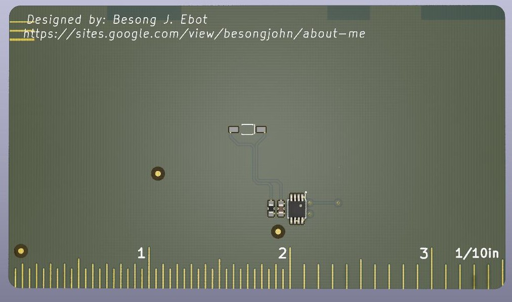
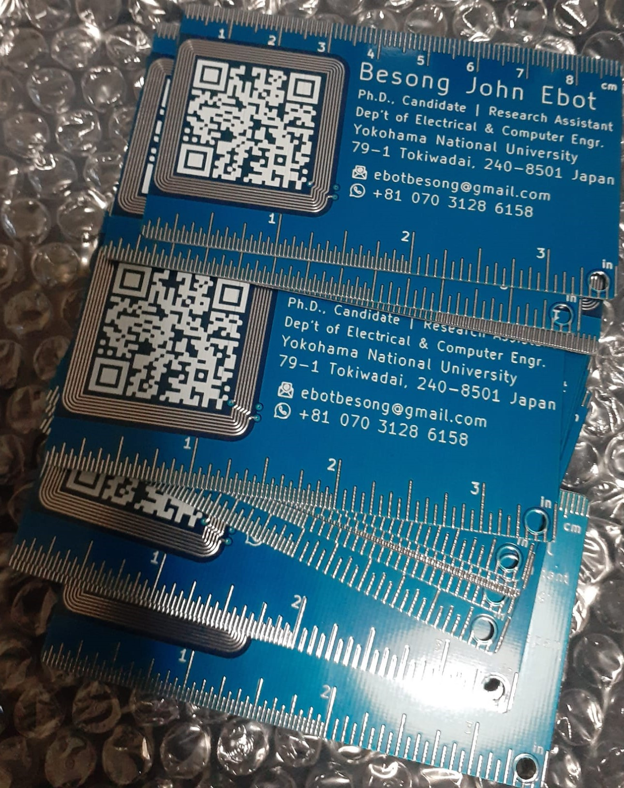
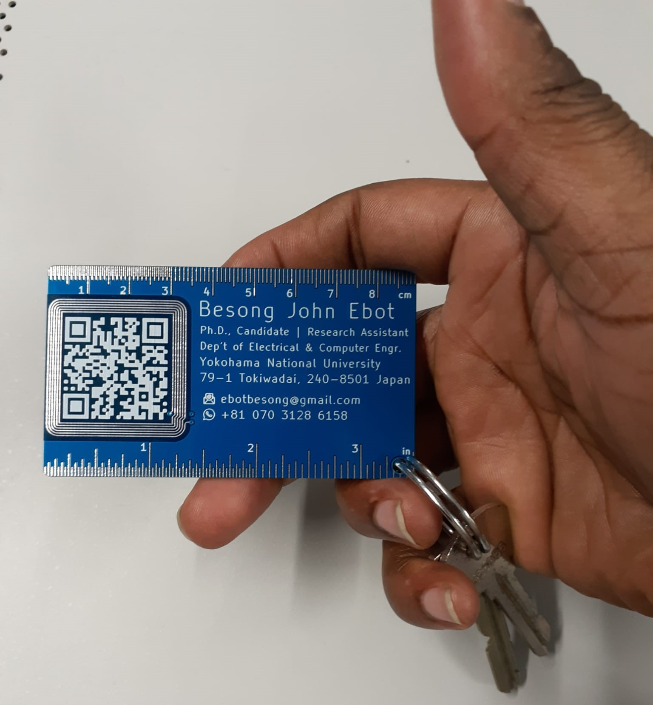

# Business card
This is my business card project. The card is designed on a PCB board using the KICAD 5.61 EDA. The idea is not completely new and was done in a bit to understand the PCB manufacturing supply chain. I got the card manufactured in China using JLPCB and shipped back to me at Tokyo.

A Through hole was added so that the cards can served as a keyholder. I use one myself as a personal keyholder.  All designed files are made available for anyone interested in the project to use, replicate and modify.
## Top view  

## Pcb card

## Pcb card back view

## Manufactured card from JLPCB

## Manufacture card

## Manufactured card

